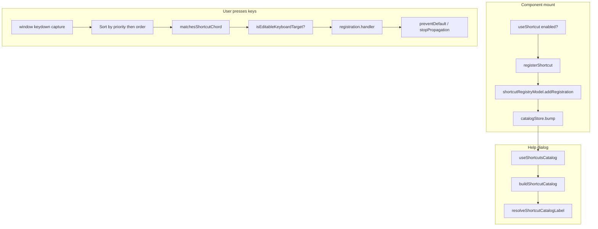

# Keyboard shortcut system (`@/lib/shortcuts`)

App-level keyboard shortcuts: components register chords in memory, a global listener matches them in the **capture** phase, and a **keyboard shortcuts** dialog lists everything currently registered.

There is no central JSON or database. At runtime the source of truth is the **registry** in `shortcutRegistryModel.ts`, updated when components mount or unmount via `useShortcut`.

---

## Where it is wired in the app

| Piece                       | Location                                                                                                                               |
| --------------------------- | -------------------------------------------------------------------------------------------------------------------------------------- |
| **`ShortcutProvider`**      | `src/components/layout/AppShell.tsx` — wraps the main shell (not login/register/forgot-password; see `LayoutWrapper.tsx`).             |
| **`ShortcutHelpHost`**      | Mounted inside `ShortcutProvider` — **Ctrl+/** (mod+Slash) toggles the help popup.                                                     |
| **`UniversalShortcutHost`** | Mounted inside `ShortcutProvider` — **Ctrl+,** focuses the active search field.                                                        |
| **Help UI**                 | `ShortcutHelpHost.tsx`, `ShortcutHelpPopup.tsx` under `src/components/layout/`.                                                        |
| **Modal Escape**            | `modalEscapeStack.ts` + `BlurPopupWrapper.tsx` — separate from the shortcut registry; see [Escape and overlays](#escape-and-overlays). |

---

## Mental model

1. **Provider** owns one **registry model** (mutable registrations + catalog store).
2. **`useShortcut`** registers on mount (or when `enabled` becomes true); cleanup removes the entry.
3. On **`keydown`**, the provider sorts registrations by **priority** then **order**, finds the **first** match that passes the **editable guard**, runs **`handler`**, then by default **`preventDefault` + `stopPropagation`**.
4. The **catalog** is derived for the help table (`buildShortcutCatalog` → `useShortcutsCatalog` via `useSyncExternalStore`).



---

## File map

| File                                   | Role                                                                                      |
| -------------------------------------- | ----------------------------------------------------------------------------------------- |
| **`types.ts`**                         | `ShortcutChord`, `ShortcutRegistration`, `ShortcutCatalogEntry`, context types.           |
| **`ShortcutProvider.tsx`**             | Registry model, global `keydown` listener, contexts, mounts help + universal hosts.       |
| **`shortcutRegistryModel.ts`**         | `entries[]`, add/remove, `getDispatchEntries`, owns `catalogStore`.                       |
| **`shortcutCatalogStore.ts`**          | `subscribe`, `getVersion`, `bump`, `getEntries`.                                          |
| **`buildShortcutCatalog.ts`**          | One row per `id` (newest `order` wins), sorted by `label`.                                |
| **`matchesShortcutChord.ts`**          | Chord matching + `normalizeKeyboardKey`.                                                  |
| **`isEditableKeyboardTarget.ts`**      | Input/textarea/select/contenteditable guard.                                              |
| **`formatShortcutChordForDisplay.ts`** | OS-aware display strings for the help table.                                              |
| **`resolveShortcutCatalogLabel.ts`**   | Maps stable shortcut `id` → i18n dictionary keys.                                         |
| **`universalShortcut.ts`**             | Shared chords/ids for **New** (Ctrl+.) and **Focus search** (Ctrl+,); search-root helper. |
| **`useShortcut.ts`**                   | Effect-based registration; optional **`enabled`**.                                        |
| **`useShortcutsCatalog.ts`**           | Help dialog data source.                                                                  |
| **`ShortcutRegisterContext.tsx`**      | `registerShortcut` / `useShortcutContext`.                                                |
| **`ShortcutCatalogStoreContext.tsx`**  | Catalog store instance.                                                                   |
| **`index.ts`**                         | Public re-exports (core API only; import `universalShortcut` by path).                    |

Layout-only (not in this folder): `ShortcutHelpHost.tsx`, `ShortcutHelpPopup.tsx`, `UniversalShortcutHost.tsx`, `modalEscapeStack.ts`.

---

## Core types

### `ShortcutChord` (`types.ts`)

- **`mod: true`** — either **Ctrl** or **Cmd** (cross-platform primary modifier).
- **`ctrl` / `meta` / `alt` / `shift`** — explicit modifiers when you need stricter combos.
- **`code`** — `KeyboardEvent.code` (layout-stable): `Backslash`, `Slash`, `Comma`, etc.
- **`key`** — logical key: `"."`, `"escape"`, `"b"`, etc.

If both `code` and `key` are set, **`code` wins** in `matchesShortcutChord`.

**Note:** Universal **New** uses `{ ctrl: true, key: "." }` (Ctrl+period), not `mod: true`, so it does not fire with Cmd+. on macOS unless you add a separate registration.

### `ShortcutRegistration`

| Field                 | Purpose                                                                                                                                                   |
| --------------------- | --------------------------------------------------------------------------------------------------------------------------------------------------------- |
| **`id`**              | Stable string; catalog dedupes by `id` (newest registration wins).                                                                                        |
| **`chord`**           | Key combination to match.                                                                                                                                 |
| **`handler`**         | `(event: KeyboardEvent) => void` when chord matches and guards pass.                                                                                      |
| **`allowInEditable`** | Default **false**: skipped while focus is in an input-like control. Set **`true`** for shortcuts that should work while typing (New, focus search, help). |
| **`priority`**        | Higher runs **earlier**; **first match wins** for the whole keypress.                                                                                     |
| **`label`**           | Help table fallback; localized via `resolveShortcutCatalogLabel` when mapped.                                                                             |
| **`stopEvent`**       | Default **true**: `preventDefault` + `stopPropagation` after handler.                                                                                     |

### `useShortcut` and `enabled`

```ts
useShortcut({
  id: "example.action",
  chord: MY_CHORD,
  handler,
  enabled: isPopupClosed && userMayAct, // optional; default true
});
```

When **`enabled` is false**, nothing is registered (no catalog row, no dispatch). Use this to disable list-page **New** while a create-invoice popup is open, or invoice **Add product** while the SKU popup is already open.

### Dispatch ordering

1. **`priority` descending** (higher first),
2. then **`order` descending** (newer mount = larger `order`).

The loop stops at the **first** matching entry. Lower-priority shortcuts never run for that keypress.

### Catalog vs dispatch

- **Dispatch** uses every active registration (sorted as above).
- **Help catalog** uses **`buildShortcutCatalog`**: one row per **`id`**, keeping the registration with the **largest `order`**, then sorting by **`label`** (help UI re-sorts by localized `displayLabel`).

---

## Modifier matching (summary)

Implemented in **`matchesShortcutChord.ts`** / **`modifiersMatch`**:

- **`mod: true`** requires Ctrl or Meta.
- Unless **`shift` / `alt` / `ctrl` / `meta`** are explicitly allowed, **extra modifiers fail the match** (e.g. `Ctrl+Shift+B` does not match `Ctrl+B`).
- When **`mod` is undefined**, bare **`ctrlKey` / `metaKey`** on the event also fail the match unless the chord uses `mod: true` or explicit `ctrl`/`meta`.

Read **`modifiersMatch`** before changing behavior.

---

## Built-in and universal shortcuts

| Chord                      | `id`                         | Where                       | `allowInEditable` | `priority` | Behavior                                                           |
| -------------------------- | ---------------------------- | --------------------------- | ----------------- | ---------- | ------------------------------------------------------------------ |
| **mod + \\** (`Backslash`) | `app-shell.toggle-sidebar`   | `AppShell.tsx`              | false             | 0          | Toggle sidebar                                                     |
| **mod + /** (`Slash`)      | `shortcuts.open-help`        | `ShortcutHelpHost.tsx`      | true              | 1000       | Toggle shortcuts help                                              |
| **Ctrl + ,** (`Comma`)     | `app.universal-focus-search` | `UniversalShortcutHost.tsx` | true              | 500        | Focus first text control in topmost `[data-universal-search-root]` |
| **Ctrl + .**               | `app.universal-new`          | List pages (below)          | true              | 0          | Open “create new” for that screen                                  |
| **Ctrl + .**               | `invoice.add-product`        | `AddProductPopup.tsx`       | true              | **2000**   | Open add-by-SKU popup on invoice product tables                    |

### `app.universal-new` (Ctrl+.) on list screens

Same chord and **`id`** everywhere so the help dialog shows one **New** row. Each page supplies its own handler:

| Page / component                             | Handler effect                | Typical `enabled`                          |
| -------------------------------------------- | ----------------------------- | ------------------------------------------ |
| `admin/users/page.tsx`                       | Open add-user flow            | always (admin page)                        |
| `cashier/selling/page.tsx`                   | Open `AddSellingInvoicePopup` | `canCreateSelling && !addInvoicePopupOpen` |
| `manager/invoices/import/page.tsx`           | Open create import invoice    | `canManage && !addInvoicePopupOpen`        |
| `manager/invoices/stock-adjustment/page.tsx` | Open create stock adjustment  | `canManage && !addInvoicePopupOpen`        |
| `ProductTableHeader.tsx`                     | `onAddProduct()`              | `onAddProduct != null`                     |

Constants live in **`universalShortcut.ts`** (`UNIVERSAL_NEW_SHORTCUT_*`).

### `invoice.add-product` vs `app.universal-new`

Both use **Ctrl+.** on invoice edit screens. **`invoice.add-product`** has **`priority: 2000`** so it wins while `AddProductPopup` is mounted and enabled. List-page **`app.universal-new`** should set **`enabled: false`** when a create-invoice popup is open so only one handler is active.

`AddProductPopup` registers with:

```ts
enabled: newShortcutEnabled && !open && !openBulkPicker,
priority: INVOICE_ADD_PRODUCT_NEW_SHORTCUT_PRIORITY,
```

### Focus search (`app.universal-focus-search`)

- **`UniversalShortcutHost`** calls **`focusDeepestUniversalSearchTarget()`**.
- Search regions mark a root with **`data-universal-search-root`** (see `UNIVERSAL_SEARCH_ROOT_DATA_ATTR` in `universalShortcut.ts`).
- **`RuleInput`** sets this attribute automatically; some popups (e.g. unit picker) set it manually.
- The **last** matching root in document order wins (topmost portaled dialog).

---

## Internationalization

Help labels use **`resolveShortcutCatalogLabel(dict, id, fallbackLabel)`** (`resolveShortcutCatalogLabel.ts`). Map new global shortcut ids in **`SHORTCUT_ID_TO_LABEL_KEY`** and add dictionary keys in `src/lib/lang/`.

Known ids:

- `app-shell.toggle-sidebar` → `shortcutLabelToggleSidebar`
- `shortcuts.open-help` → `shortcutLabelOpenHelp`
- `app.universal-new` → `shortcutLabelUniversalNew`
- `app.universal-focus-search` → `shortcutLabelUniversalFocusSearch`
- `invoice.add-product` → `addProduct`

Page-local shortcuts can keep a plain English **`label`** until you add a mapping.

---

## How to add a shortcut

1. **`"use client"`** on the component.
2. Render under **`ShortcutProvider`** (shell routes already do).
3. Import **`useShortcut`** from `@/lib/shortcuts` or `@/lib/shortcuts/useShortcut`.
4. Define a **module-level** chord constant (`as const`) so the effect does not re-run every render.
5. Use **`useCallback`** for handlers that close over state/props.
6. Pick a **globally unique `id`** and a **`label`** (or map the id for i18n).
7. Set **`enabled`** when the action should only exist in some UI states.
8. Set **`priority`** when multiple components might register the same chord (invoice product UI vs list **New**).

Example:

```tsx
"use client";

import useShortcut from "@/lib/shortcuts/useShortcut";
import { useCallback, useState } from "react";

const SAVE_CHORD = { key: "s", mod: true } as const;

export default function Example() {
  const [dirty, setDirty] = useState(false);

  const onSave = useCallback(function onSave(): void {}, []);

  useShortcut({
    id: "example.save",
    chord: SAVE_CHORD,
    label: "Save",
    handler: onSave,
    allowInEditable: false,
    enabled: dirty,
    priority: 0,
  });

  return null;
}
```

### Pitfalls

- **Browser shortcuts** — `mod+s` may trigger “Save page”; test target browsers.
- **Inline chord objects** — new object every render → effect churn. Use module constants.
- **Same chord, different actions** — use **`priority`** and **`enabled`**, not duplicate ids with different handlers.
- **Typing in fields** — default **`allowInEditable: false`**; universal **New** / focus search use **`UNIVERSAL_NEW_SHORTCUT_ALLOW_IN_EDITABLE`** (`true`).
- **`useShortcutContext`** is only for custom registration; for the help list use **`useShortcutsCatalog`**.

---

## Escape and overlays

Two mechanisms coexist:

### 1. Shortcut registry (this folder)

Global shortcuts use **`addEventListener(..., { capture: true })`**. Handlers that use default **`stopEvent`** call **`preventDefault` + `stopPropagation`**, so bubble-phase listeners on descendants may not see the key.

### 2. Modal Escape stack (`modalEscapeStack.ts`)

**Not** part of the shortcut registry. **`BlurPopupWrapper`** registers **`registerModalEscapeHandler(onClose)`** while `open` is true.

- Listens on **`window` `keydown` capture** for **`Escape`** only.
- Calls the **top** stack entry’s `onClose` **without popping** first; entries are removed only when the overlay **unmounts** (unregister cleanup). That way a nested confirm dialog does not drop the parent draft popup from the stack when Escape closes the confirm.
- Multiple open modals stack in open order; each Escape closes one layer.

Shortcut handlers and the Escape stack both use capture phase; registration order and whether a shortcut consumed the event determine what runs. The help popup still closes via the modal stack when Escape is not consumed by a higher-priority shortcut.

---

## Public API surface

From **`@/lib/shortcuts`** (`index.ts`):

- **`ShortcutProvider`**, **`useShortcut`**, **`useShortcutContext`**, **`useShortcutsCatalog`**
- **`matchesShortcutChord`**, **`normalizeKeyboardKey`**, **`isEditableKeyboardTarget`**, **`formatShortcutChordForDisplay`**
- Types: **`ShortcutChord`**, **`ShortcutRegistration`**, **`ShortcutCatalogEntry`**, etc.

Also import from **`@/lib/shortcuts/universalShortcut`** for shared chords/ids/helpers, and **`@/lib/shortcuts/resolveShortcutCatalogLabel`** for help label resolution.

---

## Why the registry is not in React state

The registry lives in a **plain closure** (`shortcutRegistryModel.ts`) so the catalog store can expose **`getRegistry()`** without reading **`ref.current` during render** when wiring **`useSyncExternalStore`**. The provider uses **`useState`** once to hold a **stable model instance** per `ShortcutProvider`.

---

## Extending the system

Implemented today:

- **`enabled`** guard on `useShortcut`
- **Universal** New / focus-search chords and search-root targeting
- **Priority** for competing registrations
- **i18n** for catalog labels by shortcut `id`

Reasonable next steps:

- User-editable bindings (localStorage or profile API) layered above this registry
- Export **`universalShortcut`** from `index.ts` if you want a single import path
- **`data-shortcuts`** (or similar) to opt specific inputs out of the editable guard

If this README and the TypeScript sources disagree, treat the **sources** as authoritative.
